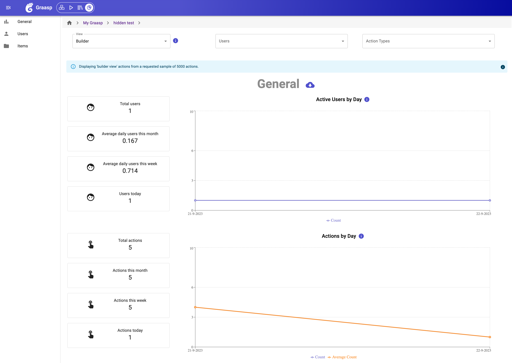

# Graasp Analytics

## Screenshot



## Installation

1. Run `yarn` to install the dependencies.
2. Run [the API](https://github.com/graasp/graasp) at `localhost:3000`
3. Set the following environnement variables in `.env.development` (place this file at your project root)

```sh
VITE_PORT=3113
VITE_VERSION=latest
VITE_GRAASP_API_HOST=http://localhost:3000
VITE_ENABLE_MOCK_API=false
VITE_GRAASP_API_HOST=http://localhost:3000
VITE_GRAASP_AUTH_HOST=http://localhost:3001
VITE_GRAASP_PLAYER_HOST=http://localhost:3112
VITE_GRAASP_LIBRARY_HOST=http://localhost:3005
VITE_GRAASP_BUILDER_HOST=http://localhost:3111
```

4. Run `yarn start`. The client should be accessible at `localhost:3113`
